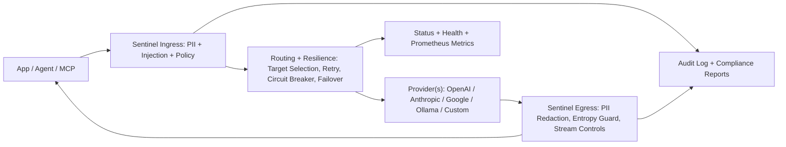

# Sentinel Protocol


Sentinel Protocol is a local-first AI governance firewall for agents, MCP servers, and LLM apps.

It sits between your app and model providers and gives you deterministic controls for:

- data leakage prevention
- prompt injection defense
- tool abuse and loop containment
- budget and reliability guardrails
- auditable governance evidence

If you are shipping AI features locally every day, Sentinel helps you ship faster with fewer security incidents and less operational chaos.

## Executive Summary (Enterprise)

Sentinel Protocol is a local AI governance perimeter that reduces four enterprise risks immediately:

- **Data risk**: blocks or redacts sensitive data on ingress and egress.
- **Safety risk**: detects injection and tool-abuse patterns with deterministic policy actions.
- **Reliability risk**: contains upstream failures with retry/circuit-breaker/failover controls.
- **Audit risk**: produces verifiable evidence (CI gates, SBOMs, reliability reports, signed governance artifacts).

Deployment model is simple:

- start local (`npx sentinel-protocol init && npx sentinel-protocol start`)
- roll out monitor-first
- enforce incrementally with explicit config and no silent behavior shifts

## Proof Links (Hard Evidence)

- Baseline freeze tag: `release-baseline-7186f1f`
- Baseline commit: `7186f1fdad29c927753e4c08a32fa47ab0257ec9`
- Evidence doc: `docs/releases/SECURITY_RELIABILITY_EVIDENCE_7186f1f.md`
- 30/60/90 execution board: `docs/releases/EXECUTION_BOARD_30_60_90.md`
- OWASP LLM Top 10 mapping: `docs/OWASP_LLM_TOP10_SENTINEL_MAP.md`
- CI run (all key jobs green): `https://github.com/myProjectsRavi/sentinel-protocol/actions/runs/22214993518`
- Quality gates job: `https://github.com/myProjectsRavi/sentinel-protocol/actions/runs/22214993518/job/64256888360`
- Docker quickstart smoke job: `https://github.com/myProjectsRavi/sentinel-protocol/actions/runs/22214993518/job/64256947051`
- SBOM artifact digest: `sha256:fdff3692aca5cc48d31c402b7a8455fa6033290f2aee43f5172970a9365ca171`

## Architecture at a Glance



Operational model:

- deterministic policy modes (`monitor`, `warn`, `enforce`)
- config-as-contract (strict validation, migration, unknown-key rejection)
- local-first runtime with optional precision/fallback providers

## Why Sentinel Exists

Agent-powered apps fail in the same ways repeatedly:

- secrets and PII leak through prompts, tool calls, and model outputs
- jailbreaks bypass weak prompt-only safeguards
- retries and loops silently burn budget
- flaky upstream providers create outages and bad UX
- teams cannot prove what happened after an incident

Sentinel solves these with a deterministic enforcement perimeter you control locally.

## What Huge Problems Sentinel Solves

| Problem | Typical Failure | Sentinel Fix |
|---|---|---|
| PII leaks to prompts/logs/output | customer data exposed to third-party models | ingress + egress PII scanning with severity actions (`block`, `redact`, `log`) |
| Prompt injection and tool abuse | model ignores policy, executes risky tools | heuristic + neural injection detection, policy engine, canary tool traps |
| Agent loops and runaway cost | repeated calls, rising spend, no kill switch | loop breaker + budget enforcement + deterministic response headers |
| Provider instability | timeout storms and cascading failures | conservative retry + circuit breaker + resilience mesh failover |
| Weak post-incident evidence | no replayable trail of decisions | structured audit stream + compliance and red-team tooling |
| Streaming and websocket blind spots | SSE/websocket paths bypass controls | SSE egress guards + websocket interception with policy parity |
| Config drift and silent misconfig | typos silently disable defenses | strict schema validation, unknown-key rejection, versioned migrations |

## What Makes Sentinel Unique

Most projects do one or two of these. Sentinel combines all of them in one local deployable runtime:

- deterministic local policy engine (`monitor`, `warn`, `enforce`)
- ingress + egress scanning (including streaming and websocket paths)
- worker-thread scanning and inference to protect event-loop responsiveness
- DNS rebinding mitigation with target resolution pinning
- hop-by-hop and internal header scrubbing before upstream forwarding
- policy-bundle signing and provenance signing (ed25519)
- CI-grade evidence model: coverage gate, benchmark gate, SBOM artifacts, reliability proofs

This is a governance perimeter, not just another model wrapper.

## Daily Developer Impact

Sentinel improves local developer workflow immediately:

- safer local testing with real prompts and stricter leak controls
- faster debugging through explicit `x-sentinel-*` diagnostics
- less time building one-off ad hoc guardrails in each app
- cleaner incident triage through centralized audit logs
- predictable behavior from config contracts and monitor-first rollouts

You can run it on your laptop in minutes and keep your current SDK/app code with minimal changes.

## Quick Start (Primary Path: npx)

### 1. Initialize config

```bash
npx sentinel-protocol init
```

This creates `~/.sentinel/sentinel.yaml`.

### 2. Validate readiness

```bash
npx sentinel-protocol doctor
```

### 3. Start Sentinel

```bash
npx sentinel-protocol start --dashboard
```

By default Sentinel runs at:

```text
http://127.0.0.1:8787
```

Dashboard (when enabled):

```text
http://127.0.0.1:8788
```

### 4. Route requests through Sentinel

Set your SDK base URL to Sentinel and specify provider target with headers:

- `x-sentinel-target: openai|anthropic|google|ollama|custom`
- optional routing contract: `x-sentinel-contract`

Health check:

```bash
curl -sS http://127.0.0.1:8787/_sentinel/health
```

## Quick Start (Secondary Ops Path: Docker)

```bash
git clone https://github.com/myProjectsRavi/sentinel-protocol.git
cd sentinel-protocol
docker-compose up -d
```

Then:

```bash
curl -sS http://127.0.0.1:8787/_sentinel/health
```

## Simple Setup Recipes

These are minimal edits to the generated `~/.sentinel/sentinel.yaml`.

### A. Safe Local Default (Monitor-First)

```yaml
mode: monitor

runtime:
  fail_open: false
  scanner_error_action: allow

pii:
  enabled: true
  provider_mode: local

injection:
  enabled: true
  action: block
```

Why this is good for daily dev:

- you see policy violations without breaking every request immediately
- you collect audit evidence before tightening enforcement

### B. Strict Team Gateway (Enforce)

```yaml
mode: enforce

rules:
  - name: block-admin-export
    match:
      method: POST
      path_contains: /admin/export
    action: block
    message: blocked by sentinel policy

runtime:
  rate_limiter:
    default_limit: 60
    default_window_ms: 60000
```

### C. Hybrid PII Mode (Local + Precision Fallback)

```yaml
pii:
  enabled: true
  provider_mode: hybrid
  rapidapi:
    endpoint: "https://pii-firewall-edge.p.rapidapi.com/redact"
    host: "pii-firewall-edge.p.rapidapi.com"
    fallback_to_local: true
    api_key: ""
```

Recommended key handling:

- set `SENTINEL_RAPIDAPI_KEY` in environment
- avoid committing API keys into config files

## Real-World Local Workflows

### 1. Build Features With Dummy Keys (Safer Supply Chain)

Use Sentinel auth vault so app code uses dummy credentials while Sentinel injects real keys at the proxy boundary.

```yaml
runtime:
  upstream:
    auth_vault:
      enabled: true
      mode: replace_dummy
      dummy_key: "sk-sentinel-local"
```

### 2. Red-Team Your Endpoint Before Merge

```bash
sentinel red-team run --url http://127.0.0.1:8787 --target openai --out ./red-team-report.json
sentinel red-team run --url http://127.0.0.1:8787 --target openai --report html --out ./red-team-report.html
```

### 3. Generate Compliance Evidence

```bash
sentinel compliance report --framework soc2 --audit-path ~/.sentinel/audit.jsonl --out ./soc2-evidence.json
```

### 4. Validate Reliability Under Chaos

```bash
npm run reliability -- --duration 4 --connections 20 --chaos-requests 16 --timeout-requests 10 --websocket-requests 8
```

## Security Model (How Sentinel Is Secured)

### Deterministic Control Plane

- explicit modes: `monitor`, `warn`, `enforce`
- strict schema validation with unknown-key rejection
- config migrations are versioned and loud on failure

### Ingress + Egress Protection

- request-side scanning for PII/injection risk
- response-side scanning and redaction
- SSE stream controls for line-size limits and redaction behavior
- entropy analyzer for encoded exfiltration signals

### Network and Routing Hardening

- DNS rebinding mitigation with target resolution pinning
- custom target allowlisting and private-network controls
- hop-by-hop header stripping
- Sentinel internal header scrubbing (`x-sentinel-*` removed before upstream)

### Runtime Safety and Resilience

- worker-thread offload for heavy scan/inference workloads
- conservative retry policies
- per-provider circuit breakers with clear state transitions
- local policy decisions separated from upstream breaker scoring

### Agent Abuse Controls

- loop breaker for repeated payload patterns
- intent throttle and drift signals
- canary tool traps and rollback pathways

### Cryptographic Governance

- ed25519 policy bundle signing and verification
- provenance signing support for responses/stream trailers

### Auditability and Forensics

- structured audit log with decision metadata
- deterministic red-team HTML reporting without raw prompt leakage
- reliability and benchmark artifacts for release proof

## WebSocket + Streaming Protection

Sentinel supports websocket interception (Phase A) and streaming protections:

- websocket upgrade policy parity with HTTP policy checks
- monitor-first websocket decisioning with warning headers
- active websocket tunnel tracking + idle timeout controls
- graceful shutdown of tracked sockets
- SSE response scanning/redaction on egress

## Control Plane Endpoints

- `GET /_sentinel/health`
- `GET /_sentinel/metrics` (Prometheus exposition)
- `GET /_sentinel/provenance/public-key`
- `GET /_sentinel/swarm/public-key`

OpenAPI contract: `docs/openapi.yaml`

## CLI Reference (Most Used)

```bash
# init and start
sentinel init
sentinel start --dashboard

# safety and diagnostics
sentinel doctor
sentinel status --json
sentinel emergency-open on
sentinel emergency-open off

# stop
sentinel stop

# monitoring
sentinel monitor

# MCP mode
sentinel mcp

# config ops
sentinel config validate
sentinel config migrate --to-version 1 --write --backup
```

## Programmatic Embedding API

```js
const express = require('express');
const { createSentinel } = require('sentinel-protocol/embed');

const app = express();

const sentinel = createSentinel({
  version: 1,
  mode: 'monitor',
  proxy: { host: '127.0.0.1', port: 8787, timeout_ms: 30000, max_body_bytes: 1048576 },
  runtime: {
    fail_open: false,
    scanner_error_action: 'allow',
    upstream: {
      retry: { enabled: true, max_attempts: 1, allow_post_with_idempotency_key: false },
      circuit_breaker: {
        enabled: true,
        window_size: 20,
        min_failures_to_evaluate: 8,
        failure_rate_threshold: 0.5,
        consecutive_timeout_threshold: 5,
        open_seconds: 20,
        half_open_success_threshold: 3,
      },
      custom_targets: { enabled: false, allowlist: [], block_private_networks: true },
    },
  },
  pii: {
    enabled: true,
    provider_mode: 'local',
    max_scan_bytes: 262144,
    regex_safety_cap_bytes: 51200,
    severity_actions: { critical: 'block', high: 'block', medium: 'redact', low: 'log' },
    rapidapi: {
      endpoint: 'https://pii-firewall-edge.p.rapidapi.com/redact',
      host: 'pii-firewall-edge.p.rapidapi.com',
      timeout_ms: 4000,
      request_body_field: 'text',
      fallback_to_local: true,
      allow_non_rapidapi_host: false,
      api_key: '',
      extra_body: {},
    },
  },
  injection: { enabled: true, threshold: 0.8, max_scan_bytes: 131072, action: 'block' },
  rules: [],
  whitelist: { domains: [] },
  logging: { level: 'info' },
});

sentinel.use({
  name: 'example-plugin',
  hooks: {
    'request:prepared': async (ctx) => {
      if (ctx.get('path') === '/v1/private') {
        ctx.block({ statusCode: 403, body: { error: 'PLUGIN_DENY' }, reason: 'example_policy' });
      }
    },
  },
});

app.use('/v1', sentinel.middleware());
app.listen(3000);
```

## CI Quality and Enterprise Evidence

Sentinel ships with hard gates in CI:

- lint gate (`eslint --max-warnings=0` + static security checks)
- OpenAPI validation
- unit + integration + reliability suites
- coverage gate (`npm run test:coverage:gate`)
- benchmark regression gate (`npm run benchmark:gate`)
- npx bootstrap path validation (`init` + `start`)
- SBOM generation (CycloneDX + SPDX)
- Docker quickstart smoke test

Baseline release evidence:

- `docs/releases/SECURITY_RELIABILITY_EVIDENCE_7186f1f.md`
- `docs/releases/EXECUTION_BOARD_30_60_90.md`
- `docs/releases/research/WASM_SCANNER_RESEARCH_TRACK.md`
- `docs/releases/tickets/T2-001-COVERAGE-RATCHET.md`
- `docs/releases/tickets/T2-002-SERVER-EXTRACTION.md`
- `docs/releases/tickets/T2-003-EMBED-TYPING-POLISH.md`

## Docker (Production-Style Local Ops)

Build image:

```bash
docker build -t sentinel-protocol:latest .
```

Run container:

```bash
docker run --rm -p 8787:8787 \
  -e NODE_ENV=production \
  -e SENTINEL_HOME=/var/lib/sentinel \
  -v $(pwd)/config/sentinel.yaml:/etc/sentinel/sentinel.yaml:ro \
  -v sentinel-data:/var/lib/sentinel \
  sentinel-protocol:latest start --config /etc/sentinel/sentinel.yaml --port 8787
```

Compose path:

```bash
docker-compose up -d
```

## Integrations

Example integration guides:

- OpenAI SDK
- Anthropic SDK
- LangChain
- CrewAI
- Vercel AI SDK

See: `docs/INTEGRATIONS.md`

## Common Questions

### Is Sentinel only for production?

No. Sentinel is highly useful in local daily dev because it catches leaks, jailbreaks, and cost/routing mistakes before they reach production.

### Do I need cloud services to use it?

No. Core mode is local-first. Optional precision/fallback modes are opt-in.

### Does Sentinel replace provider SDKs?

No. Keep your existing SDKs and point base URLs to Sentinel.

### Can I start monitor-first and enforce later?

Yes. That is the recommended rollout model.

## Contributing

- `CONTRIBUTING.md`
- `docs/PLUGIN_TUTORIAL.md`
- `docs/OUTAGE-RUNBOOK.md`
- `docs/OWASP-HARDENING.md`

## License

MIT
