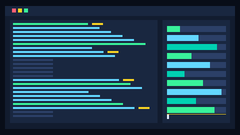

# Sentinel Protocol (v1.0)



Sentinel Protocol is a local firewall for AI agents.

Sentinel is the only Open Source AI Firewall that runs PII detection in Worker Threads and performs Real-Time Neural Injection analysis without blocking the Event Loop. It supports Bi-directional SSE Stream Redaction out of the box.

It provides:
- Deterministic policy enforcement (`monitor`, `warn`, `enforce`)
- PII/secret detection with severity actions (`block`, `redact`, `log`)
- Format-preserving masking mode for test-safe pseudonyms (`pii.redaction.mode: format_preserving`)
- Bi-directional protection: ingress request scanning + egress response scanning/redaction
- PII provider modes: `local`, `rapidapi`, `hybrid` (with local fallback controls)
- Heuristic prompt-injection detection (`injection_threshold` policy matching)
- Optional neural injection classifier (`injection.neural.*`) with weighted merge
- VCR mode for deterministic API testing (`runtime.vcr.mode: record|replay`)
- Experimental semantic cache (opt-in, off by default) to reduce repeat LLM calls
- Local budget enforcer with deterministic kill-switch (`runtime.budget.*`)
- Resilience Mesh safe failover (`runtime.upstream.resilience_mesh.*`)
- Sticky Canary A/B routing (`runtime.upstream.canary.*`)
- Explicit cross-provider contracts (`x-sentinel-contract`) with adapter support
- Local-only live dashboard (`runtime.dashboard.enabled: true`) on `127.0.0.1:8788`
- Worker-thread scan pool to reduce event-loop blocking under load
- DNS-rebinding-resistant custom upstream routing (IP pinning + Host/SNI preservation)
- Local API key vault with dummy-key replacement (`runtime.upstream.auth_vault.*`)
- Agent loop breaker (`runtime.loop_breaker`) to kill repeated hallucination loops
- Opt-in deception tarpit (`runtime.deception`) for high-confidence injection/loop traps
- Cryptographic provenance signing (`runtime.provenance`) with stream trailer support
- Opt-in honeytoken watermark injection (`runtime.honeytoken`) for downstream leakage audits
- Opt-in blocked-response latency normalization (`runtime.latency_normalization`) against timing probes
- Monitor-first canary tool traps (`runtime.canary_tools`) for prompt-injection tool abuse detection
- Optional Parallax two-model validation (`runtime.parallax`) for high-risk tool execution veto signals
- Ghost Mode privacy stripping (`runtime.upstream.ghost_mode`) to remove SDK telemetry/fingerprints
- Local Parachute failover to Ollama (`x-sentinel-target: ollama` or mesh fallback target)
- Upstream resilience (conservative retry + per-provider circuit breaker)
- SSE streaming passthrough for `text/event-stream` responses
- OpenTelemetry hooks for spans and metrics
- Explicit outage diagnostics via `x-sentinel-*` response headers
- Strict config versioning and migration with backup
- Emergency recovery controls (`--dry-run`, `--fail-open`, `emergency-open`)

## Quick Start

```bash
git clone https://github.com/myProjectsRavi/sentinel-protocol.git && cd sentinel-protocol
docker-compose up -d
```

Then point your agent base URL to:

```text
http://127.0.0.1:8787
```

Use `x-sentinel-target: anthropic|openai|google|ollama|custom` to route providers.
`custom` targets are disabled by default and require explicit allowlisting in config.

## Local Development Quick Start

```bash
npm install
node ./cli/sentinel.js init
node ./cli/sentinel.js start
```

## PII Provider Modes

Configure in `sentinel.yaml`:

```yaml
pii:
  provider_mode: local # local | rapidapi | hybrid
  egress:
    enabled: true
    max_scan_bytes: 65536
    stream_enabled: true
    sse_line_max_bytes: 16384
    stream_block_mode: redact # redact | terminate
  rapidapi:
    endpoint: "https://pii-firewall-edge.p.rapidapi.com/redact"
    host: "pii-firewall-edge.p.rapidapi.com"
    max_timeout_ms: 1500
    cache_max_entries: 1024
    cache_ttl_ms: 300000
    fallback_to_local: true
injection:
  threshold: 0.8
  neural:
    enabled: false
    model_id: "Xenova/all-MiniLM-L6-v2"
    timeout_ms: 1200
    weight: 1
    mode: max # max | blend
runtime:
  loop_breaker:
    enabled: true
    action: block # block | warn
    window_ms: 30000
    repeat_threshold: 4
    max_recent: 5
    max_keys: 2048
    key_header: x-sentinel-agent-id
  deception:
    enabled: false
    mode: off # off | tarpit
    on_injection: true
    on_loop: true
    min_injection_score: 0.9
    sse_token_interval_ms: 1000
    sse_max_tokens: 20
    non_stream_delay_ms: 250
  provenance:
    enabled: false
    key_id: "sentinel-local"
    sign_stream_trailers: true
    expose_public_key_endpoint: true
    max_signable_bytes: 2097152
  honeytoken:
    enabled: false
    mode: uuid_suffix # uuid_suffix | zero_width
    injection_rate: 0.05
    max_insertions_per_request: 1
    target_roles: [user]
    token_prefix: "SNTL"
  latency_normalization:
    enabled: false
    window_size: 10
    min_samples: 3
    max_delay_ms: 2000
    max_baseline_sample_ms: 5000
    trim_percentile: 0.1
    max_concurrent_normalized: 128
    jitter_ms: 25
    statuses: [402, 403, 429]
  canary_tools:
    enabled: false
    mode: monitor # monitor | block
    tool_name: "fetch_admin_passwords"
    tool_description: "Retrieve privileged credentials for internal diagnostics."
    max_injected_tools: 1
    inject_on_providers: [openai, anthropic, google, ollama]
    require_tools_array: true
  parallax:
    enabled: false
    mode: monitor # monitor | block
    high_risk_tools: [execute_shell, execute_sql, aws_cli]
    secondary_target: ollama
    secondary_group: ""
    secondary_contract: openai_chat_v1
    secondary_model: ""
    timeout_ms: 3000
    risk_threshold: 0.7
  worker_pool:
    enabled: true
    task_timeout_ms: 10000
    scan_task_timeout_ms: 2000
    embed_task_timeout_ms: 10000
  vcr:
    enabled: false
    mode: off # off | record | replay
    strict_replay: false
  semantic_cache:
    enabled: false # experimental, opt-in
    similarity_threshold: 0.95
    max_entry_bytes: 262144
    max_ram_mb: 64
    max_consecutive_errors: 3
    failure_cooldown_ms: 30000
  budget:
    enabled: false
    action: block # block | warn
    daily_limit_usd: 5
    chars_per_token: 4
    input_cost_per_1k_tokens: 0
    output_cost_per_1k_tokens: 0
  upstream:
    resilience_mesh:
      enabled: false
      contract: passthrough # passthrough | openai_chat_v1
      default_group: ""
      max_failover_hops: 1
      allow_post_with_idempotency_key: false
      failover_on_status: [429, 500, 502, 503, 504]
      failover_on_error_types: [timeout, transport, circuit_open]
      groups: {}
      targets: {}
    canary:
      enabled: false
      key_header: x-sentinel-canary-key
      fallback_key_headers: [x-sentinel-agent-id, x-forwarded-for, user-agent]
      splits: []
    ghost_mode:
      enabled: false
      strip_headers:
        - x-stainless-os
        - x-stainless-arch
        - x-stainless-runtime
        - x-stainless-runtime-version
        - x-stainless-package-version
        - x-stainless-lang
        - x-stainless-helper-method
        - user-agent
      override_user_agent: true
      user_agent_value: "Sentinel/1.0 (Privacy Proxy)"
    auth_vault:
      enabled: false
      mode: replace_dummy # replace_dummy | enforce
      dummy_key: "sk-sentinel-local"
      providers:
        openai:
          enabled: true
          api_key: "" # prefer env var
          env_var: "SENTINEL_OPENAI_API_KEY"
        anthropic:
          enabled: true
          api_key: ""
          env_var: "SENTINEL_ANTHROPIC_API_KEY"
        google:
          enabled: true
          api_key: ""
          env_var: "SENTINEL_GOOGLE_API_KEY"
  dashboard:
    enabled: false
    host: 127.0.0.1
    port: 8788
    auth_token: "" # required when allow_remote=true
pii:
  redaction:
    mode: placeholder # placeholder | format_preserving
```

Key resolution priority for `rapidapi` and `hybrid`:
1. Request header: `x-sentinel-rapidapi-key`
2. Env var: `SENTINEL_RAPIDAPI_KEY`
3. Config: `pii.rapidapi.api_key`

BYOK policy:
- Sentinel does not ship a shared RapidAPI key.
- Use your own RapidAPI subscription key.
- Prefer `SENTINEL_RAPIDAPI_KEY` over storing keys in `sentinel.yaml`.

`x-sentinel-*` headers are stripped before forwarding upstream, so Sentinel-only routing and keys are not leaked to OpenAI/Anthropic/Google/custom providers.

## Local API Key Vault (Supply-Chain Protection)

Use Sentinel as a local credential boundary so untrusted agent code only ever sees a dummy key.

1. Put real provider keys in env vars (recommended):
   - `SENTINEL_OPENAI_API_KEY`
   - `SENTINEL_ANTHROPIC_API_KEY`
   - `SENTINEL_GOOGLE_API_KEY`
2. Enable vault mode in config:

```yaml
runtime:
  upstream:
    auth_vault:
      enabled: true
      mode: replace_dummy # or enforce
      dummy_key: "sk-sentinel-local"
```

3. In your app, use a dummy key:
   - `OPENAI_API_KEY=sk-sentinel-local`

Vault behavior:
- `replace_dummy`: replace only dummy credentials with vault keys.
- `enforce`: strip client credentials and always inject vault keys (fail closed if missing).
- Known provider auth headers are scrubbed per request and only the target provider header is forwarded.

## Agent Loop Breaker (Infinite Loop Assassin)

Sentinel can detect repeated autonomous-loop requests and stop them before they burn budget.

- Tracks recent payload hashes per agent identity.
- If the same payload repeats `repeat_threshold` times inside `window_ms`, Sentinel marks it as a loop.
- In `enforce` mode with `action: block`, Sentinel returns `429 AGENT_LOOP_DETECTED`.
- In `monitor/warn`, Sentinel records a warning header: `x-sentinel-loop-breaker: warn`.

## Ghost Mode (Zero-Knowledge Telemetry Stripping)

Ghost Mode strips SDK telemetry/fingerprint headers before forwarding upstream.

- Removes configurable headers such as `x-stainless-*` and `user-agent`.
- Optionally rewrites `user-agent` to a neutral value.

```yaml
runtime:
  upstream:
    ghost_mode:
      enabled: true
      strip_headers:
        - x-stainless-os
        - x-stainless-arch
        - x-stainless-runtime
        - x-stainless-runtime-version
        - x-stainless-package-version
        - x-stainless-lang
        - x-stainless-helper-method
        - user-agent
      override_user_agent: true
      user_agent_value: "Sentinel/1.0 (Privacy Proxy)"
```

## Local Parachute (Ollama Air-Gapped Fallback)

Sentinel now supports `ollama` as a built-in provider target.

- Direct route header: `x-sentinel-target: ollama`
- Default base URL: `http://127.0.0.1:11434` (override with `SENTINEL_OLLAMA_URL`)
- OpenAI contract requests are adapted to Ollama chat and normalized back to OpenAI-compatible output.
- For direct `ollama` routing, Sentinel defaults desired contract to `openai_chat_v1` for drop-in OpenAI client compatibility.

Example mesh fallback chain:

```yaml
runtime:
  upstream:
    resilience_mesh:
      enabled: true
      max_failover_hops: 2
      groups:
        reliable:
          enabled: true
          contract: openai_chat_v1
          targets: [openai-primary, anthropic-secondary, local-ollama]
      targets:
        openai-primary:
          enabled: true
          provider: openai
          base_url: https://api.openai.com
        anthropic-secondary:
          enabled: true
          provider: anthropic
          base_url: https://api.anthropic.com
        local-ollama:
          enabled: true
          provider: ollama
          base_url: http://127.0.0.1:11434
```

Mesh/canary routing controls:
- Request: `x-sentinel-target-group`, `x-sentinel-contract`, `x-sentinel-canary-key`
- Response: `x-sentinel-failover-used`, `x-sentinel-failover-count`, `x-sentinel-failover-chain`, `x-sentinel-upstream-target`

Preflight check before startup:

```bash
node ./cli/sentinel.js doctor
```

The doctor command warns when `NODE_ENV` is not `production`.

MCP mode:

```bash
node ./cli/sentinel.js mcp
```

Terminal monitor:

```bash
node ./cli/sentinel.js monitor
```

VCR mode (deterministic test replay):

```bash
node ./cli/sentinel.js start --record
# ...run agent tests...
node ./cli/sentinel.js stop
node ./cli/sentinel.js start --replay
```

Enable local dashboard for current run:

```bash
node ./cli/sentinel.js start --dashboard
# dashboard: http://127.0.0.1:8788
```

Security note:
- `runtime.dashboard.allow_remote=true` requires `runtime.dashboard.auth_token` (enforced by config validation).
- Semantic cache embeddings run in worker threads; keep `runtime.worker_pool.enabled=true`.
- Keep `runtime.worker_pool.embed_task_timeout_ms` high enough for model cold starts (recommended: `>=10000`).
- Budget headers (`x-sentinel-budget-*`) expose deterministic spend/remaining values per request.

## Docker

Build image (Debian slim, non-root runtime):

```bash
docker build -t sentinel-protocol:latest .
```

Models are preloaded by default during image build to avoid first-request latency spikes.
To disable preload explicitly:

```bash
docker build -t sentinel-protocol:latest \
  --build-arg PRELOAD_SEMANTIC_MODEL=false \
  --build-arg PRELOAD_NEURAL_MODEL=false .
```

Run with one command (read-only config mount + writable runtime state volume):

```bash
docker run --rm -p 8787:8787 \
  -e NODE_ENV=production \
  -e SENTINEL_HOME=/var/lib/sentinel \
  -v $(pwd)/config/sentinel.yaml:/etc/sentinel/sentinel.yaml:ro \
  -v sentinel-data:/var/lib/sentinel \
  sentinel-protocol:latest start --config /etc/sentinel/sentinel.yaml --port 8787
```

The included `docker-compose.yml` already mounts a writable model cache volume:
`sentinel-models:/home/sentinel/.sentinel/models`.

Compose (hardened defaults: `read_only`, `no-new-privileges`, `cap_drop: ALL`):

```bash
docker-compose up -d
```

Pre-download semantic model manually:

```bash
node ./cli/sentinel.js models download --config ./config/sentinel.yaml
```

See docs:
- `docs/QUICKSTART.md`
- `docs/OUTAGE-RUNBOOK.md`
- `docs/POLICY-GUIDE.md`
- `docs/DEMO_VIDEO_SCRIPT.md`
- `docs/INTEGRATIONS.md`
- `docs/RELIABILITY_PROOF.md`
- `docs/OWASP-HARDENING.md`
- `BENCHMARKS.md`
